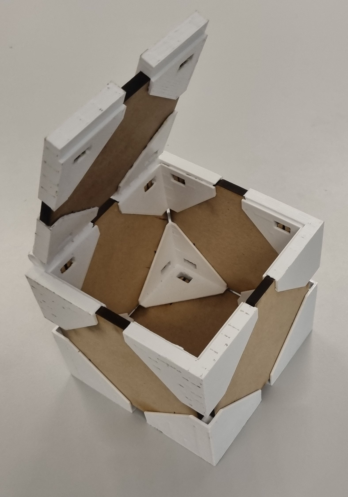

# MMA4002 — Box Assembly with Omron TM Collaborative Robot

Course project from **MMA4002 Design for Automated Manufacturing** at NTNU Ålesund. End-to-end design of a box product and autonomous assembly using an Omron TM-series collaborative robot (cobot). Group project (group 3).

## Demo

> **Single take, no cuts** — the full assembly cycle is completed by the cobot from start to finish.
> Full-speed video on YouTube: https://youtu.be/96OegzUco4I

## Finished product

Hinged box with 3D-printed corner brackets joining laser-cut panels. Lid hinges at one corner.

## Project scope

- **Box design** — designed a box with custom corner interface, hinge and latch, all 3D-printable for assembly by a robot arm.
- **Custom assembly jigs** — designed two jigs (jig1, jig2) to hold parts in known positions for cobot pick-up.
- **Vision-guided picking** — used Omron TM Vision with a printed landmark to locate parts at the start of each cycle.
- **TM Flow programming** — sequenced pick, place, and assembly motions on the cobot teach pendant.
- **Iterative prototyping** — multiple revisions of corner interface and hinge before final design.
- **Verification** — full assembly cycle executed in one continuous run (see GIF/video).

## Hardware and tools

- **Cobot:** Omron TM-series collaborative robot
- **Gripper:** standard (stock) gripper
- **Vision:** Omron TM Vision with a landmark for part-position reference
- **Programming environment:** Omron TM Flow (graphical task programming on the teach pendant)
- **Manufacturing:** 3D printing (Prusa i3MK3S) and CO2 laser cutting (Epilog Fusion M2, 60 W) for box parts and jigs
- **CAD:** Autodesk Fusion

## Files

- `README.md` — this file
- `full_assembly_x8.gif` — full assembly cycle at 8x speed
- `cad/` — STEP files of all designs
  - `prototype-assembly.step` — full box assembly
  - `prototype-side.step` — box side
  - `prototype-corner.step` — corner part
  - `prototype-corner-hinge.step` — hinge corner
  - `prototype-corner-latch.step` — latch corner
  - `jig-assembly-2.step`, `jig-assembly-3.step`, `jig2-assembly.step` — assembly jigs
- `photos/` — setup, jigs, mid-assembly, finished box, gripper

## Course

[MMA4002 Design for Automated Manufacturing](https://www.ntnu.edu/studies/courses/MMA4002) — NTNU Ålesund, Department of ICT and Natural Sciences.

## Author

**Modestas Sukarevicius** — MSc Mechatronics and Automation, NTNU Ålesund. Contact: modesuka@gmail.com.
